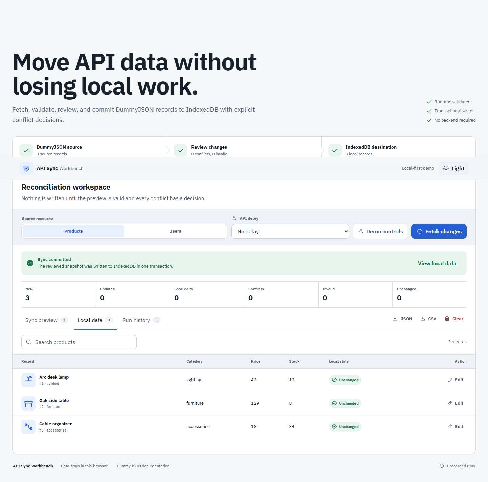
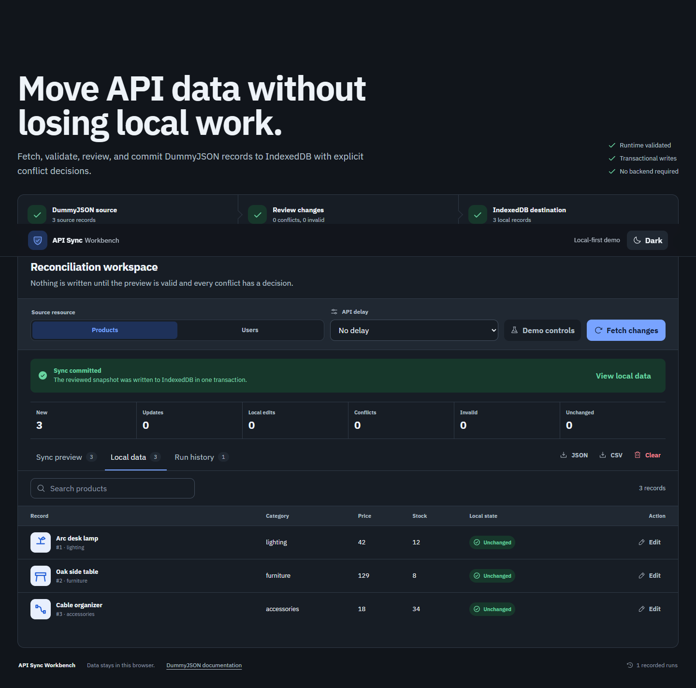
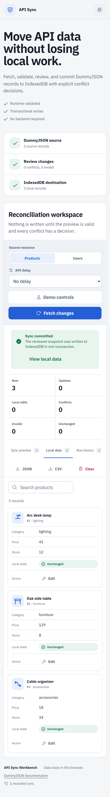

# API Sync Workbench

API Sync Workbench is a client-only React demo that reconciles real DummyJSON resources with a browser-local IndexedDB database. It is designed to demonstrate reliable API integration work to prospective freelance clients without requiring a backend or credentials.

[Open the public GitHub Pages demo](https://uhavenicemom.github.io/api-sync-workbench/).



[Watch the 29-second fetch, review, and IndexedDB sync walkthrough](docs/media/demo.webm).

## Interface preview

<p align="center">
  
  
</p>

Ready-to-paste English and Ukrainian freelance project descriptions are available in [`PORTFOLIO.md`](PORTFOLIO.md).

## What the demo proves

- Runtime validation at the API boundary.
- A reviewable diff before any local mutation.
- Three-way comparison of the last source snapshot, current source data, and local edits.
- Explicit conflict resolution with `Keep local` and `Use source`.
- Atomic IndexedDB writes and persistent browser-local data.
- Retry-safe failure recovery and an auditable run history.
- JSON and spreadsheet-safe CSV export.
- Responsive, keyboard-accessible light and dark interfaces.

DummyJSON write operations are simulated and non-persistent. This project therefore treats DummyJSON as a read source and IndexedDB as the durable demo destination. The upstream-change control is clearly labeled as a simulation.

## Local development

Requirements:

- Node.js 24
- pnpm 11.19 or compatible

```bash
pnpm install
pnpm dev
```

Vite prints the local URL. No environment variables or API keys are required.

## Verification commands

```bash
pnpm lint
pnpm typecheck
pnpm test
pnpm build
pnpm exec playwright install chromium
pnpm test:e2e
```

`pnpm check` runs lint, TypeScript, unit and integration tests, and the production build. Browser tests intercept DummyJSON requests with deterministic fixtures so CI does not depend on third-party availability.

## Demo walkthrough

1. Select Products or Users.
2. Choose an optional API delay and select **Fetch changes**.
3. Review new, updated, unchanged, locally edited, conflicting, or invalid records.
4. Resolve every conflict and select **Apply sync**.
5. Open **Local data** and edit a record.
6. Enable **Change the source copy** in Demo controls, then fetch again.
7. Compare both versions and choose which complete record to keep.
8. Export the local resource as JSON or CSV.

The **Fail the next request once** control demonstrates recovery without destroying the current configuration or previously stored data.

## Architecture

```text
DummyJSON
   ↓ fetch + runtime validation
Resource adapter
   ↓ normalized records
Three-way sync engine
   ↓ deterministic preview + decisions
IndexedDB repository
   ↓ one transaction per applied resource
Local records, history, JSON and CSV
```

- `src/domain`: resource contracts, hashing, and deterministic reconciliation.
- `src/infrastructure`: DummyJSON and IndexedDB boundaries.
- `src/features`: export and theme behavior.
- `src/components`: operational UI and state-specific surfaces.
- `e2e`: browser-level workflows with mocked network responses.
- `PRODUCT.md`: durable product requirements.
- `DESIGN.md`: visual system and interaction rules.

## IndexedDB data model

Each record stores:

- the latest local copy;
- the latest observed source copy;
- a deterministic hash for each copy;
- sync and local-edit timestamps.

If only the source changed, the record can update. If only the local copy changed, it is preserved. If both changed from the same baseline, the preview requires a conflict decision.

## Data safety and privacy

- No credentials, tokens, cookies, or personal accounts are used.
- Data is stored only in the current browser and origin.
- Clearing site storage removes the local database.
- The application never silently deletes locally stored records.
- CSV cells beginning with spreadsheet formula characters are neutralized.
- API data is rendered through React and is never injected as raw HTML.

## GitHub Pages

The Vite build uses relative asset URLs, so the artifact works for both account sites and repository subpaths.

1. Push the project to a GitHub repository whose default branch is `main`.
2. Open **Settings → Pages**.
3. Set **Build and deployment → Source** to **GitHub Actions**.
4. Run **Verify and optionally deploy GitHub Pages** manually and enable the `deploy` input.

Pushes and pull requests run verification only. A Pages deployment requires an explicit manual run with `deploy` enabled; that run verifies lint, types, tests, the production build, and Chromium E2E before uploading `dist`. Publication was intentionally not performed as part of the local project build.

## Current scope

Included: Products, Users, local editing, record-level conflict decisions, recovery simulations, history, export, themes, desktop and mobile workflows.

Excluded: authentication, backend storage, cloud accounts, scheduled sync, arbitrary API endpoints, field-level merge, automatic deletion, PWA background sync, and true two-way remote persistence.

## Troubleshooting

- **DummyJSON cannot be reached:** retry after checking connectivity. Existing IndexedDB data remains available.
- **A preview shows invalid records:** those records failed runtime validation and will not be written.
- **Source simulation is disabled:** apply an initial sync, edit a local record, then reopen Demo controls.
- **GitHub Pages is blank:** confirm that Pages uses GitHub Actions and that the workflow uploaded the `dist` directory.
- **Local data appears missing:** IndexedDB is isolated by browser profile and site origin. `localhost`, a preview URL, and GitHub Pages each have separate storage.
